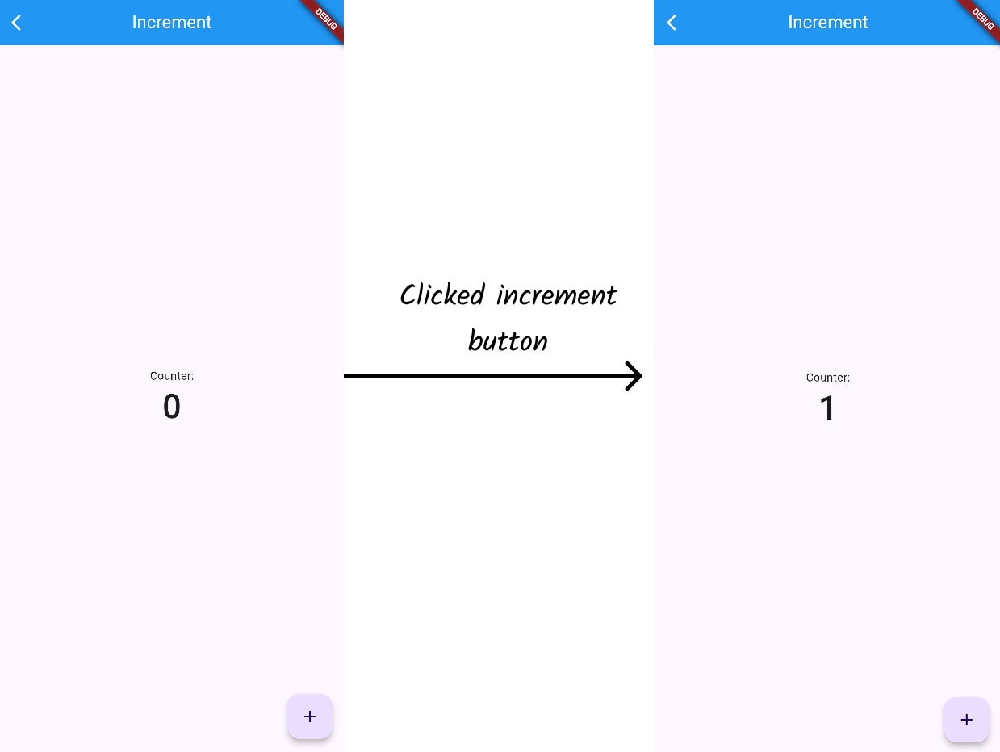

# HW 6 - Test Driven Development

The objective for this homework assignment is to practice Test-Driven-Development (TDD). In TDD we start by developing our tests first, then we develop the code to simply pass those tests, and lastly we refactor out code to resemble our prototype. 

Remember TDD is a cycle of Fail -> Pass -> Refactor, so it's to be expected that refactoring your code may cause to tests to fail again. If this happens, simply restart the Fail -> Pass -> Refactor cycle as many times as needed.


The tests that will guide your development are located in `integration_test/` and `test/`. These tests are the same except, `integration_test/` tests run if you're working on the assignment locally and `test/` tests run if you're working in Codespaces.

**Do NOT edit the tests**

All you modifications/changes should be on the `lib/screens/` files.

## Screen 1: Increment

**Given** you are on the Increment page **And** the counter is set to 0,

**When** the increment button is clicked,

**Then** the counter should become 1.



## Screen 2: Converter

**Given** you are on the Feet Converter page **And** you input 6,

**When** the "Convert" button is clicked,

**Then** the page should show "Yards: 2".


## Screen 3: Has Numbers

**Given** you are on the Has Numbers page **And** you input "be3",

**When** the "Find Numbers" button is clicked,

**Then** the page should show "Has Numbers: true".


## Run Tests

Each time you finish writting your code for a single Screen, go ahead and run the integration test. Use the following commands to run the tests. The tests will also be run by GitHub everytime you push.

### For Codespaces

```
flutter test test/test.dart
```

### For Local Computer

```
flutter test integration_test/test.dart
```
